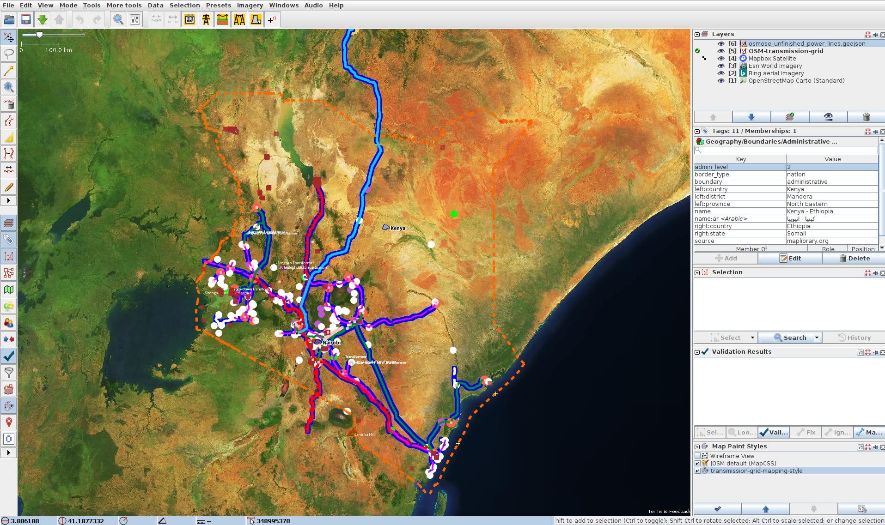

# Grid Mapping Starter Kit

**A starter kit for Electrical Transmission Grid Mapping in OpenStreetMap, combining Osmose and Overpass with JOSM.**

> We offer one-to-one workshops to help you get started. Please [contact the maintainer](https://github.com/Ly0n) of this repository to book a free training session. 

## Setup Mapping Environment
1. First install Java on your machine, followed by the latest version of JOSM. [Download here](https://josm.openstreetmap.de/).
2. Configure the JOSM user interface and presets according to your needs. A preconfigured preferences file is [available here](josm-config/preferences.xml). The [JOSM wiki](https://josm.openstreetmap.de/wiki/Help/Preferences) provides details on where to place the `preferences.xml` file, depending on your operating system.
3. The [paint map style](josm-config/transmission_grid_mapping_style.mapcss) is dynamically loaded from this GitHub repository and optimized for large-scale transmission grid mapping using [this URL](https://raw.githubusercontent.com/open-energy-transition/grid-mapping-starter-kit/refs/heads/main/josm-config/transmission_grid_mapping_style.mapcss). If you want to use a custom paint style, download the file to your local machine, modify it, and add it to JOSM under **Edit → Preferences → Map Paint Styles**.
4. Load the [template session](josm-config/transmission_grid_mapping_template.joz) by selecting **File → Open**.
5. Create an [OSM](https://www.openstreetmap.org/) account. Add a new OSM token to JOSM under **Edit → Preferences → OSM Server → Authorise Now → Login**. **Be aware that your token will be stored in your local `preferences.xml` file. Do not share this file with anyone.**
6. To show the Overpass Turbo tab in the Download window, you have to activate the **View → Expert Mode**. 

## Download Transmission Data and Issues
1. Zoom and move (right click) to the area you want to map. Activate the `osm-transmission-grid` layer and press the Download button (green arrow). Switch to the **Download from Overpass API** tab. Add the content of the [transmission-grid.overpassql](josm-config/transmission-grid.overpassql) to the script field.
2. Select the **Slippy Map** tab in the **Download from Overpass API** and draw a bounding box for the area you want to map. The script will retrieve all the data from the administrative area you cover with the bounding box. If you only want data from a single region, draw the box inside the region so that it covers most of the central region of the country. Depending on the country you are mapping, you may want to divide the mapping regions into states, as the data for some countries will be extensive. To do this, simply change the **"admin_level"** in the script. 
3. Press "Download" to receive the relevant data for transmission grid mapping using the preconfigured Overpass Turbo script. If the download fails, the timeout may be too low or the bounding box too large. You should consider mapping at the state level or reducing the size of your bounding box. When drawing a bounding box, make sure it is similar in size to the administrative area otherwise you will get "No info found" errors. If this happens increase the size of the bounding box and make sure it covers the center of the region. The script also offers the option of downloading data based on country or state names. Further information on this can be found in the commentary in the script. 
4. Visit [Osmose](https://osmose.openstreetmap.fr/en/map/#loc=7/4.907/-72.994&level=1%2C2%2C3&tags=power&class=2&item=7040) and activate only **"Power lines"**. Click the plus symbol next to it and select **"Unfinished power major line"**. Zoom to the area of interest, **activate the Osmose layer in JOSM**, switch back to Osmose, and press **Export → JOSM**. This will export the Osmose information to that specific layer. Towers with "Unfinished power major line" should now be visible in the Osmose layer in JOSM.
   - If the towers are not visible, try the following:
     - Disable your ad blocker.
     - Enable **Remote Control** under **Edit → Preferences** in JOSM.
     - Reduce the visible area in Osmose.
5. We also provide a [Python script](https://github.com/open-energy-transition/grid-mapping-starter-kit/blob/main/scripts/osmose_per_country.py) that enables you to load all **Unfinished power major line** issues from a country or state as a geoJSON. This allows you to load those issues as another data layer into JSOM via the **File → Open** 
6. Enable **"Discourage Upload"** for the Osmose layer to prevent accidental uploads. You can now investigate each Osmose error in the transmission grid. After fixing an issue (or if you cannot fix it), remove the tower from the Osmose layer to track your progress.

## How to Map and Upload your Progress
1. For ease of mapping, customise your toolbar with presets. **Edit → Preferences → Toolbar**. Then select the **Presets → Man Made → Man Made/Power** and add power towers, power portals etc.
2. Start Mapping. Read more about the [general mapping process in JOSM](https://learnosm.org/en/josm/more-about-josm/). Place nodes (eg.power towers, power portals) or place polygons to delimit an area (eg. substation, generator), and press on the preset structure you want it to be.
3. With the OpenStreetMap layer activated, press the green Upload arrow.

## Mapping Strategies
The following strategies outline different approaches to extending the existing transmission network. In general, the larger the tower and substation, the higher the voltage and therefore the greater the importance to the network. Priority should therefore be given to large, high-voltage infrastructure first. The easiest way to start mapping the transmission network is to find the location of new 'towers'. You can hardly go wrong with this and it will help you to familiarise yourself with the tool and the local network. **Only map infrastructure that you can confidently classify using satellite or ground imagery.**

- [ ] Search for all **"Unfinished major power lines"** in Osmose and check if you are able to find new towers at the ende of the line. After fixing an issue (or if you cannot fix it), remove the tower from the Osmose layer to track your progress.
- [ ] Check if windparks, solar farms, and power plants are connected to the transmission grid.
- [ ] Ensure all transmission substations are connected to the grid.
- [ ] Identify obvious gaps in the network topology from a national perspective.
- [ ] Search for new lines parallel to existing ones and new lines starting from major central transmission substations.
- [ ] Check for news reports on new substations and transmission lines that have become operational in recent years. LLMs like ChatGPT allow you to search in the local language: _"Please search for news about transmission lines or substation recently opened in country A. Please use the official language of the country for your search"_
- [ ] Search for new substation records and national substation records as a reference "hint" layer. LLMs like ChatGPT allow you to search in the local language: _"Please search for transmission lines or substation datasets in X. Please use the official language of the country for your search."_ For a curated list of datasets that may be useful, see [Awesome Electric Grid Mapping](https://github.com/open-energy-transition/Awesome-Electric-Grid-Mapping). The plugin [OpenData](https://wiki.openstreetmap.org/wiki/JOSM/Plugins/OpenData) offers you the option of using a variety of different data sets in JOSM.  

If you don't know a good country to start with, [OpenInfraMap.org's nightlights background](https://openinframap.org/#2.15/-1.45/23.58/L,N,P) can help you find countries with larger gaps in the transmission grid.

## Common Mistakes 
1. Do not use the default settings for distribution grid mapping. The Overpass Turbo script provided with this starter kit is optimised for transmission grid mapping. Lines on towers below 90 kV are not visualised in JOSM and should not be mapped with the standard configuration of this script. 
1. Not reading about [good practices](https://wiki.openstreetmap.org/wiki/Good_practice).
1. When you leave the downloaded area, you may find transmission grids that do not appear to have been mapped. Actually, they were not downloaded to JOSM and you map them 2 times. To avoid this always be aware of the country boundary and be careful when crossing highlighted dashed orange lines. Due to the design of Overpass Turbo, some elements such as power lines may still be visible. across the border, but other objects such as substations will appear as if they have not yet been mapped. 
1. Mapping beyond your experience is something you should avoid. Mapping is an iterative process and you should not expect to be able to finish all the details you are mapping. If you cannot map with a high degree of certainty, leave it to local mappers, better satellite imagery or experienced grid mappers.
1. If the routing of the lines is not completely obvious or visible in the satellite imagery, don't map it.
1. Avoid uploading large changesets. Upload your data regularly.
1. Avoid ignoring validation results. The only acceptable warning when uploading data is "Possible missing line support node within power line".
1. Don't get stuck on detail. If you can't continue a line, switch to another grid area or try it from the other side of the line.
1. Mapping the distribution power lines from satellite imagery is not possible for most regions.

## Mapping Regulations
**⚠️ Before you start mapping, please find out about the mapping restrictions in the respective country. In some countries, the mapping of transmission lines is not permitted. Get in touch with local users by finding out about [local projects](https://wiki.openstreetmap.org/wiki/Power_networks). ⚠️**
